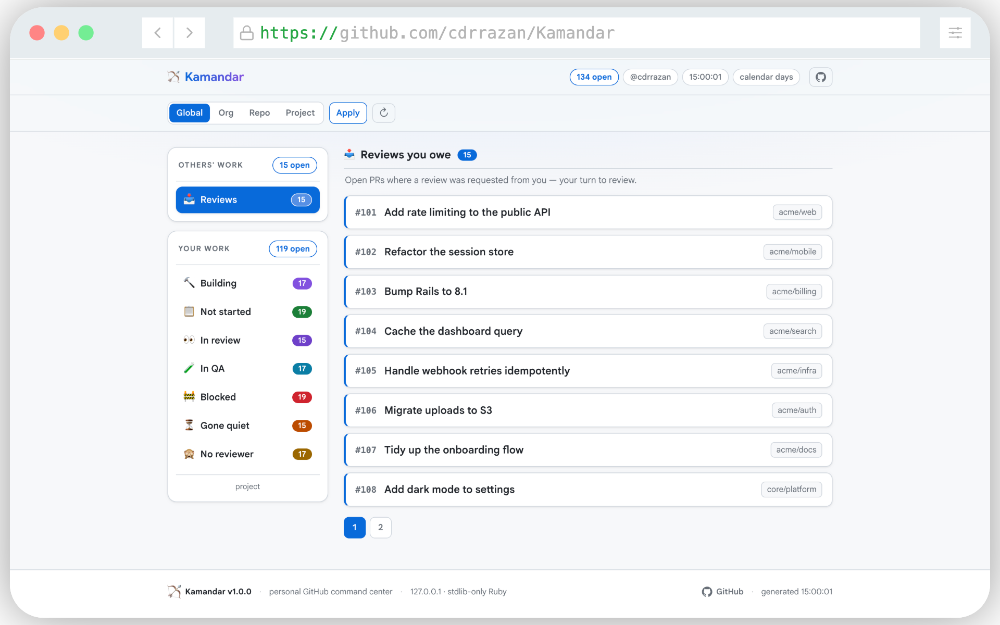
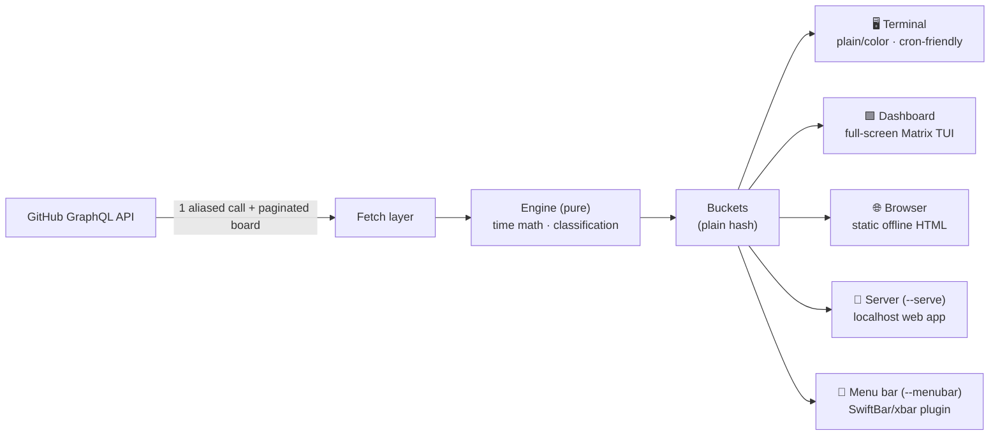
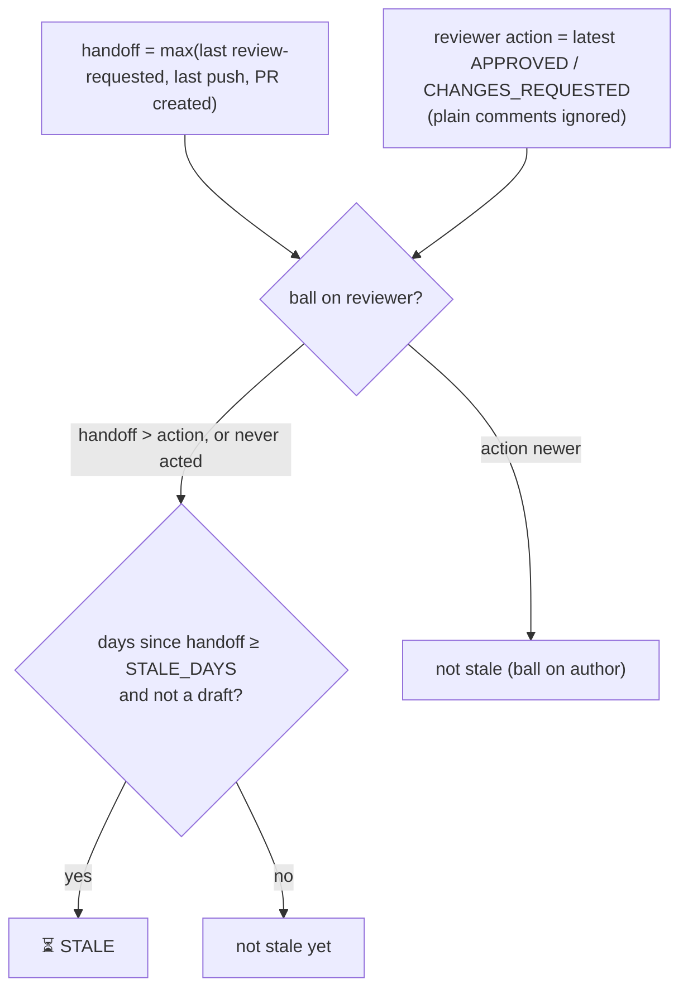

<div align="center">


# Kamandar

### Take aim at your GitHub work queue.

***Kamandar*** (کمان‌دار) is Persian for *archer* — one who draws the bow and
finds the target. A personal GitHub command center: one command shows what you
owe, what you're building, what's assigned, and what's gone quiet — as a
colored terminal report, a full-screen Matrix dashboard, a self-contained
browser page, or a live local web app. No backend; the only network listener is
the opt-in `--serve`, bound to localhost.

<br>


<br>



<sub>The live web app (`ruby lib/kamandar.rb --serve`). Pure HTML + CSS — sidebar tabs, two work boxes, and pagination, no JavaScript. Screenshot rendered with `--demo`.</sub>

</div>

---

```text
🏹 Kamandar  @you  —  2026-06-22 09:14  (business days)  [global]
========================================================================

📥 Reviews you owe (2)
----------------------
  #482 Tighten retry backoff  (acme/api)
    https://github.com/acme/api/pull/482

  #8   Cache token introspection  (acme/web)
    https://github.com/acme/web/pull/8

🔨 Currently building (WIP) (1)
-------------------------------
  #503 Spike: pluggable providers  (acme/api)
    https://github.com/acme/api/pull/503

⏳ Your PRs gone quiet (1)
--------------------------
  #501 Add billing webhook  (acme/api)  — 3 business days since you handed off
    https://github.com/acme/api/pull/501
```

> On a terminal this is colored (a 256-color palette tuned to stay legible on
> **both light and dark** backgrounds); `#numbers` align within each bucket and
> entries are spaced for scanning. Piped or redirected, it's plain text with no
> ANSI.

---

## ✨ What it shows — seven buckets (+ one bonus)

| # | Bucket | What lands here |
|---|--------|-----------------|
| 1 | 📥 **Reviews you owe** | Open PRs where review is requested *from you* |
| 2 | 🔨 **Currently building (WIP)** | Your own open **draft** PRs |
| 3 | 📋 **Assigned, not started** | Projects V2 issues assigned to you whose **Status** is in a configurable "not started" set |
| 4 | 👀 **Submitted for review** | Projects V2 issues assigned to you whose **Status** is in a configurable "in review" set |
| 5 | 🧪 **In QA** | Projects V2 issues assigned to you whose **Status** is in a configurable "QA" set |
| 6 | 🚧 **Blocked** | Projects V2 issues assigned to you whose **Status** is in a configurable "blocked" set (waiting on a requirement or someone's answer) |
| 7 | ⏳ **Your PRs gone quiet** | Your **ready** PRs where the ball is on the reviewer past a threshold |
| ➕ | 🙈 **Ready, no reviewer requested** | *(bonus)* Your ready PRs with nobody asked to review and no reviews yet — silently invisible to everyone |

> **The bucket set depends on [scope](#-scope).** The table above is **project**
> scope, where buckets #3–6 come from your board's **Status** columns. In
> **global / org / repo** scope there is no board, so those four are replaced by
> issue+PR buckets driven by the state of each assigned issue's linked PR:
>
> | Bucket | Lands here |
> |---|---|
> | 📥 Reviews you owe | `review-requested:@me` (same as project) |
> | 📋 Assigned, not started | issue assigned to you with **no linked PR** |
> | 🔨 Assigned, PR in draft | linked PR is a **draft** |
> | 👀 Assigned, PR in review | linked PR is **ready + has a reviewer** |
> | 🙈 Assigned, PR ready (no reviewer) | linked PR is ready but **nobody asked** |
> | ⏳ Your PRs gone quiet | same as project |
>
> Issue→PR links use GitHub's **"Closes #123"** references.

---

## 🚀 Quick start

> Requires **Ruby 3.2+**. No gems — standard library only.

```sh
git clone https://github.com/cdrrazan/Kamandar.git
cd Kamandar

./install.sh                     # symlink `kamandar` into ~/.local/bin (run from anywhere)
kamandar --init                  # one-time setup: save & verify your token + login
kamandar                         # terminal output (default) — from any directory now

kamandar --serve                 # live web app at http://127.0.0.1:4567
kamandar --dashboard             # full-screen Matrix TUI (digital-rain splash)
kamandar --menubar               # SwiftBar/xbar plugin — your queue in the macOS top bar
kamandar --browser               # render + open a static HTML page
kamandar -b --watch 60           # live tab, refreshed every 60s
kamandar --serve --demo          # fake data, no token — for screenshots/trials
kamandar --serve --no-open       # serve headless (don't auto-open a browser tab)
```

### Run it persistently (macOS)

Keep the web app always-on — starts at login, restarts if it ever exits:

```sh
ruby lib/kamandar.rb --init      # if you haven't already (saves token + login)
cp ~/.config/kamandar/config .env   # seed the daemon's env (token + login + PORT)
./service/install-service.sh     # render + load the launchd LaunchAgent
# → http://127.0.0.1:4567 (logs: ~/Library/Logs/kamandar.{out,err}.log)

./service/uninstall-service.sh   # stop & remove the service
```

The agent runs `kamandar --serve --no-open --tunnel` (headless) with
`KAMANDAR_CONFIG` pointed at the repo `.env`. `.env` holds your token, so it's
git-ignored — never commit it.

The Ruby server still binds `127.0.0.1` only; the `--tunnel` child runs
`cloudflared tunnel run kamandar` and publishes it at the hostname in
`~/.cloudflared/config.yml` (e.g. `kamandar.byaru.com`). **Put Cloudflare Access
in front of that hostname** — the page is your live GitHub queue, backed by a
PAT. Don't want it public? Drop `--tunnel` from the plist's `ProgramArguments`
and re-run the installer for a localhost-only daemon.

> Prefer not to install? Everything also runs in place as `ruby lib/kamandar.rb …`.

> **`--demo`** fabricates 15–20 plausible rows per bucket and skips the network
> entirely (no token or login needed) — handy for screenshots, demos, or trying a
> surface offline. It works with any surface (`--serve`, `--browser`, terminal).

> **`--serve`** is the graphical app: a localhost-only web page with a sidebar +
> tabbed buckets, in-page scope switching, a refresh button, and optional
> auto-poll — pure HTML + CSS, no JavaScript. Pure stdlib (`TCPServer`), no gems,
> bound to `127.0.0.1` only, and — like every surface — the token never reaches
> the page. Use `--port N` (or `PORT`) to change the port.

> `PROJECT_URL` is **optional** — the [scope picker](#-scope) asks for the board
> URL when you choose `project`. Set it only if you want bucket #3
> (*Assigned, not started*) populated without picking project scope, or for
> non-interactive runs (cron).

### Setup without `--init`

`--init` is just a convenience — it writes a config file so you don't re-export
vars every shell. You can skip it and provide config three ways (highest wins):

1. **CLI flags** — e.g. `--scope`, `--port`, `--theme`.
2. **Shell env** — `export GITHUB_TOKEN=… GH_LOGIN=…` (best for cron).
3. **Config file** — a flat `KEY=VALUE` file at `~/.config/kamandar/config`
   (or `$XDG_CONFIG_HOME/kamandar/config`; `$KAMANDAR_CONFIG` overrides the path
   entirely). Same names as the env vars:

   ```ini
   GITHUB_TOKEN=ghp_xxx
   GH_LOGIN=your-username
   PROJECT_URL=https://github.com/orgs/Acme/projects/4
   STALE_DAYS=3
   ```

   `kamandar --init` writes exactly this file (mode `0600`) after verifying the
   token against GitHub. Edit it by hand any time.

### Manual install

`install.sh` symlinks `lib/kamandar.rb` (a symlink, so `git pull` updates the
command in place). To do it yourself, or to pick a different directory:

```sh
chmod +x lib/kamandar.rb
ln -s "$PWD/lib/kamandar.rb" ~/.local/bin/kamandar
# or: KAMANDAR_BIN=/usr/local/bin ./install.sh
```

---

## 📂 Project layout

```text
Kamandar/
├── lib/
│   └── kamandar.rb       # engine + all surfaces + local server (single file, stdlib only)
├── test/
│   └── test_kamandar.rb  # acceptance tests — zero network, 254 cases
├── assets/
│   ├── logo-web.png      # brand mark (inlined into web surfaces; shown in this README)
│   └── favicon.ico       # served at /favicon.ico by --serve
├── install.sh            # symlink the CLI onto your PATH (stdlib only)
├── README.md
├── CONTRIBUTING.md
├── SECURITY.md
├── V2.md                 # multi-provider roadmap (design only)
└── LICENSE
```

---

## ⚙️ Configuration

> Precedence: **CLI flags > environment variables > config file**
> (`~/.config/kamandar/config`, written by `kamandar --init`).

| Var / flag | Required | Default | Purpose |
|---|:---:|---|---|
| `GITHUB_TOKEN` | ✅ | — | Classic PAT: `repo`, `read:org`, `read:project`. From env or config file. |
| `GH_LOGIN` | ✅ | — | Your GitHub username. From env or config file. |
| `--init` | | — | One-time wizard: prompt, verify token, write `~/.config/kamandar/config` (`0600`) |
| `OUTPUT` / `--browser`, `-b` | | `terminal` | Surface: `terminal` or `browser`. The flag forces browser and overrides `OUTPUT`. |
| `WATCH_SECONDS` / `--watch N` | | `0` (off) | Browser only: re-fetch + rewrite the page every N seconds |
| `PROJECT_URL` | for #3 | — | Board/view URL, e.g. `https://github.com/orgs/Recognize/projects/10/views/5` |
| `SCOPE` / `--scope` | | `global` | Scope for PR buckets (#1, #2, #7, bonus). One of `global`, `org[:NAME]`, `repo:owner/name`, `project`. See [Scope](#-scope). |
| `NOT_STARTED_STATUSES` | | `Todo,Backlog,No Status` | Status names treated as "not started" (case-insensitive) — bucket #3 |
| `REVIEW_STATUSES` | | `In Review,Review,Needs Review` | Status names treated as "in review" (case-insensitive) — bucket #4 |
| `QA_STATUSES` | | `Ready for QA,QA,In QA` | Status names treated as "in QA" (case-insensitive) — bucket #5 |
| `BLOCKED_STATUSES` | | `Blocked,On Hold,Waiting` | Status names treated as "blocked" (case-insensitive) — bucket #6 |
| `ITERATION_FILTER` | | `off` | `current` restricts #3 to the active sprint |
| `ITERATION_FIELD` | | `Iteration` | Board's iteration field name |
| `STALE_DAYS` | | `2` | Threshold (in days) for bucket #7 |
| `DAY_MODE` | | `business` | `business` (skip Sat/Sun) or `calendar` |
| `THEME` / `--theme` | | — | `matrix` renders a green-on-black boxed TUI (terminal only; pipes stay plain) |
| `--dashboard` | | off | Full-screen Matrix TUI: digital-rain splash, then live panels (`r` refresh, `q` quit). Needs an interactive TTY; falls back to plain output otherwise |
| `--serve` | | off | Live web app: localhost-only HTTP server with in-page scope controls + refresh. Token never reaches the page |
| `--port N` / `PORT` | | `4567` | Port for `--serve` (bound to `127.0.0.1` only) |
| `--tunnel [name]` / `KAMANDAR_TUNNEL` | | off | Spawn a [Cloudflare Tunnel](#remote-access-via-cloudflare-tunnel) child alongside `--serve` (implies `--serve`); tunnel name defaults to `kamandar`. Needs `cloudflared` on `PATH` |
| `--demo` | | off | Render fabricated data (15–20 rows/bucket) with no network or token — for screenshots and offline trials |

Only the **org** and **project number** are parsed from `PROJECT_URL` (via
`/orgs/<org>/projects/<num>`); the saved-view number is ignored — see
[Non-goals](#-non-goals--known-limitations).

> **Finding your board's labels.** The `*_STATUSES` vars (`NOT_STARTED_STATUSES`,
> `REVIEW_STATUSES`, `QA_STATUSES`, `BLOCKED_STATUSES`) must match your board's
> actual **Status** column names — a board's columns *are* its Status options.
> Run `ruby lib/kamandar.rb --statuses` to print every issue assigned to you with
> its exact Status (and the distinct set), then set the vars to suit. It asks for
> the board URL if `PROJECT_URL` isn't set.

---

## 🎯 Scope

By default Kamandar shows your PR buckets **account-wide**. Narrow them with
`SCOPE` (env) or `--scope` (flag; the flag wins):

| `SCOPE` | What PR buckets (#1, #2, #7, bonus) show |
|---|---|
| `global` *(default)* | Every repo your account touches |
| `org` or `org:NAME` | One org. Bare `org` reuses the org from `PROJECT_URL` |
| `repo:owner/name` | A single repo |
| `project` | PRs that **belong to** the `PROJECT_URL` board — a card on it, or one that **closes a board issue** |

```sh
ruby lib/kamandar.rb --scope org:Recognize     # one org
ruby lib/kamandar.rb --scope repo:acme/api     # one repo
SCOPE=project ruby lib/kamandar.rb             # repos on your project board
```

`org`/`repo` filter server-side via a GitHub search qualifier; `project` keeps
only the PRs that **belong to the board** — either carded on it directly, or
(the usual case, since boards track issues) a PR that **closes a board issue**
via `Closes #N`. Because the board tracks issues, a review you owe is shown as
the **board issue** the PR closes (falling back to the PR itself when it closes
no board issue) — so John's review surfaces as his card in "Ready for Review",
not a loose PR. Anything unrecognized (or
`org`/`repo` with no value, or `project` with no `PROJECT_URL`) safely falls
back to `global`. The active scope is shown in the terminal header and the
browser page.

**Interactive picker.** Run plain `ruby lib/kamandar.rb` in a terminal without
`SCOPE`/`--scope` and it asks you to pick a mode by number — you only type the
*name* for `org`/`repo`; you never type the mode itself:

```text
🏹 Kamandar — which GitHub work should I show?
Pick how wide to look. Press Enter to keep the default.

  1  global   Every repo your account touches      · default
  2  org      A single organization                · e.g. Recognize
  3  repo     A single repository                  · e.g. acme/api
  4  project  A GitHub project board               · paste its URL

Choose 1–4 (Enter = global):
```

Pick `org`/`repo` and it asks for the name (with the expected format and an
example); pick `project` and — if no `PROJECT_URL` is set — it asks for the
board URL right there (no need to export anything first). A bad `owner/name` or
board URL re-prompts; press Enter, or give a blank value, and it defaults to
**global**. On an interactive terminal the prompt is colored; piped, it's plain.
The prompt is skipped when a scope is already set, when stdin isn't a terminal
(cron/pipes), in `--serve` (the web app picks scope in-page), or in browser
mode — so nothing ever blocks.

---

## 🏗️ Architecture

**Engine → buckets → Surface** — three separable layers. The engine is pure and
side-effect-free; surfaces only consume the buckets hash and never re-query or
re-classify.



- **Engine** — pure functions (GraphQL building, time math, classification),
  unit-testable with zero network.
- **Buckets** — a plain hash the engine returns. The set depends on scope
  (board-driven for `project`, issue+PR-driven otherwise).
- **Surface** — one tiny contract (`render`/`page(buckets, ...) -> String` + an
  `emit`). Five implementations today: terminal, dashboard, browser, the
  `--serve` web app (which reuses the browser surface's CSS/cards), and the
  `--menubar` SwiftBar/xbar plugin. Each was added with **no engine change** —
  email would be the same.
- **Server** — the only *inbound* network layer: a minimal stdlib `TCPServer`
  HTTP/1.1 loop for `--serve`, bound to `127.0.0.1`. Pure helpers (request
  parsing, response framing, scope resolution) are unit-tested; the accept loop
  lives in the CLI.

Everything is guarded by `if __FILE__ == $PROGRAM_NAME` so the test suite can
`require` the file with zero network and no ENV reads.

---

## 🖥️ Surfaces

The same classified buckets feed every surface — no surface re-queries or
re-classifies.

| Surface | Command | Best for | Network |
|---|---|:---:|---|
| 🖥️ **Terminal** | `kamandar` | cron, pipes, quick checks | outbound only |
| 🟩 **Dashboard** | `kamandar --dashboard` | an ambient TTY status board | outbound only |
| 🌐 **Browser** | `kamandar --browser` | an offline, shareable HTML snapshot | none (static file) |
| 🔌 **Live web app** | `kamandar --serve` | an interactive, app-like UI | localhost listener |
| 🏹 **Menu bar** | `kamandar --menubar` | an always-there macOS top-bar count | outbound only |

### Terminal (default)

Grouped by bucket with per-bucket emoji and color **when stdout is a terminal**.
Colors use a 256-color palette tuned to stay readable on **both light and dark**
backgrounds; `#numbers` are aligned per bucket and entries are spaced for
scanning. Piped or redirected (cron, `| mail`), it automatically falls back to
plain text with no ANSI — so captured output stays clean.

Prefer a retro look? `THEME=matrix ruby lib/kamandar.rb` (or `--theme matrix`)
draws a green-on-black boxed dashboard. It's TTY-only — piped output is still
plain text.

### Dashboard (`--dashboard`)

A full-screen **Matrix TUI**: a digital-rain splash, then live green panels of
every bucket. Keys: `r` refetches, `q` (or Ctrl-C) quits. It takes over the
alt-screen buffer and always restores it on exit. Needs an interactive TTY
(stdout **and** stdin) — pipes/cron fall back to plain output with a notice.

### Live web app (`--serve`)

A **localhost-only** web page served by a minimal stdlib `TCPServer` — the
graphical, app-like surface. It re-fetches and re-classifies server-side per
request; bound to `127.0.0.1` only, `--port N` (or `PORT`) to change the port,
and — like every surface — the token never reaches any response. A fetch blip
renders an error page instead of dropping the server.

```sh
ruby lib/kamandar.rb --serve            # http://127.0.0.1:4567
ruby lib/kamandar.rb --serve --port 8080
ruby lib/kamandar.rb --serve --demo     # fabricated data, no token (the screenshot above)
```

The page is a small "command center" UI, and it's **pure HTML + CSS — no
JavaScript**:

- **Sticky app header** — a frosted top nav (the **bow-and-arrow logo** +
  wordmark, status chips, GitHub repo link) over a **toolbar row** with the
  scope control. The scope picker is a
  segmented control; the page shows just what each scope needs — `global` is
  only the picker + **Apply** + **refresh**, while `org`/`repo` reveal the name
  field, `project` reveals the board URL, and any non-global scope reveals the
  **auto-refresh** interval. The reveal is driven by CSS `:has()`, no scripting.
- **Sidebar + tabs** — buckets become tabs in two cards: **Others' work**
  (reviews requested from you) and **Your work** (your assigned issues/PRs).
  Each card shows its own open count; the selected tab fills with the bucket's
  color. Tab switching is pure-CSS (a hidden radio per bucket).
- **Main panel** — the selected bucket, with a one-line description of what it
  collects under the heading, the matching cards, or a centered empty-state
  card when nothing's waiting. Buckets with more than 8 cards **paginate**, with
  a numbered pager (also pure CSS — a hidden radio per page).
- **Footer** — version, the localhost/stdlib note, repo link, and the
  generated-at time.
- **Branding** — the logo is **inlined as a data URI** (so it ships inside the
  HTML, no extra request), and the server answers `GET /favicon.ico` with
  `assets/favicon.ico` so the browser tab gets the bow-and-arrow icon.
- Loads the **Google Sans** webfont (the one network asset, allowed here since
  the served page is online), falling back to the system font stack. Tracks
  light/dark via `prefers-color-scheme`.

#### Remote access via Cloudflare Tunnel

Want to reach the app from your phone or another machine at a real URL —
`https://kamandar.yourdomain.com` instead of `localhost:4567`? A
[Cloudflare Tunnel](https://developers.cloudflare.com/cloudflare-one/connections/connect-networks/)
does it **without changing the bind**. `cloudflared` runs on the same machine as
`--serve` and dials *outbound* to `127.0.0.1:4567`, so the server stays
localhost-only — no `0.0.0.0`, no port-forward, no open inbound firewall ports.

```
  phone / laptop ──HTTPS──► Cloudflare edge ──tunnel──► cloudflared ──► 127.0.0.1:4567
                          (kamandar.yourdomain.com)        (your machine)        (--serve)
```

> 🔒 **Gate it with Cloudflare Access — this is not optional.** The page shows
> your **private** GitHub queue (repos, PR/issue titles). The token never
> reaches the HTML, but the *data* is sensitive, and a tunnel hostname is
> reachable by anyone who has it. A self-hosted **Access** policy (free on
> Cloudflare Zero Trust) puts an email/SSO login in front so only *you* get in.
> Without it, your work queue is on the public internet.

**One-time setup** (needs a Cloudflare account + your domain on Cloudflare, and
[`cloudflared` installed](https://developers.cloudflare.com/cloudflare-one/connections/connect-networks/downloads/)):

```sh
cloudflared tunnel login                                   # authorize, pick your domain
cloudflared tunnel create kamandar                         # creates the tunnel + a creds file
cloudflared tunnel route dns kamandar kamandar.yourdomain.com   # point the hostname at it
```

Then map the hostname to the local port in `~/.cloudflared/config.yml`:

```yaml
tunnel: kamandar
ingress:
  - hostname: kamandar.yourdomain.com
    service: http://127.0.0.1:4567
  - service: http_status:404
```

Finally, in the **Cloudflare Zero Trust dashboard** → *Access → Applications*,
add a **self-hosted** app for `kamandar.yourdomain.com` with a policy that
allows only your email. (Do this before sharing or bookmarking the URL.)

**Daily use** — one command brings up both halves. `--tunnel` spawns
`cloudflared` as a child of `--serve` and tears it down on exit, so a single
Ctrl-C stops the server *and* the tunnel:

```sh
kamandar --serve --tunnel        # app on 127.0.0.1:4567 + the Cloudflare Tunnel
# → open https://kamandar.yourdomain.com, log in via Access, set Auto-refresh ~30s
# → Ctrl-C once; both the server and the tunnel shut down. URL goes dead until next time.
```

`--tunnel` runs the tunnel named `kamandar` by default; override with
`--tunnel <name>` or `$KAMANDAR_TUNNEL`. It reads `~/.cloudflared/config.yml`
for the hostname mapping (above), and falls back to serving locally (with a
warning) if `cloudflared` isn't on your `PATH`. `--tunnel` implies `--serve`.

<details><summary>Prefer two terminals?</summary>

```sh
kamandar --serve                 # terminal 1: the app on 127.0.0.1:4567
cloudflared tunnel run kamandar  # terminal 2: bridge to kamandar.yourdomain.com
```
</details>

Notes:

- **`--serve` is the host.** The tunnel is only a pipe — kill `--serve` and the
  URL returns 502. Both processes must run on the same machine, and that machine
  must stay awake (laptop asleep = URL down).
- The token + login live **only on that machine** (via `--init` or env); they
  never travel through Cloudflare.
- Auto-refresh re-queries GitHub each cycle, so keep `poll` sane (`30`+, not
  `5`) to stay well under API rate limits.
- For a quick throwaway demo with **no domain and no setup**, swap the named
  tunnel for `cloudflared tunnel --url http://127.0.0.1:4567` — it prints a
  random `*.trycloudflare.com` URL. That one is **unauthenticated**; treat the
  link as public and use it only for fabricated `--demo` data.

### Browser (offline file)

Renders **one self-contained HTML document** (inline CSS, no external/CDN
resources, works offline over `file://`) to a stable path
(`<tmpdir>/kamandar.html`) and opens it in your default browser. Bucket #7
gets a warning accent and a "days since handoff" badge per card. Dark mode via
`prefers-color-scheme`.

- **Watch mode** (`--watch N`): re-fetches, re-classifies, and rewrites the same
  file every N seconds — opening the browser only on the first cycle. The page
  carries `<meta http-equiv="refresh">` so the open tab reloads itself.
  Meta-refresh over `file://` works in current Chrome, Firefox, and Safari.
- 🔒 **Security:** the page is a static in-process snapshot. It makes no GitHub
  calls and **never contains your token or any secret** — see
  [SECURITY.md](SECURITY.md).

### Menu bar (`--menubar`)

Your queue **always in the macOS top bar** — a 🏹 + open count, click for a
dropdown of every bucket with each PR/issue deep-linked to GitHub. The bar tints
**orange** when a review is owed or a PR has gone quiet.

stdlib Ruby can't draw a status item, so this rides on
[**SwiftBar**](https://swiftbar.app) (or [xbar](https://xbarapp.com)) — a tiny
app that runs a script on an interval and renders its stdout in the menu bar.
`--menubar` emits exactly that plugin document (one line = the bar title, `---`
opens the dropdown, `--` nests a row, ` | href= color=` set params). SwiftBar is
an external app, like `cloudflared` — **not** a Ruby dependency.

```sh
brew install swiftbar                 # then launch it once and pick a plugin folder
./menubar/install-menubar.sh 5m       # render the plugin into that folder, refresh every 5m
./menubar/uninstall-menubar.sh        # remove it
```

The installer fills in this machine's repo/ruby/home and points
`KAMANDAR_CONFIG` at the repo `.env` (token + login), so the plugin loads
credentials the same way the launchd service does. Long buckets cap at 12 rows
with an "…and N more" link to the web app. Like every surface, **the token never
appears in the output**.

```sh
kamandar --menubar          # print the plugin document yourself (one shot)
kamandar --menubar --demo   # fabricated data, no token — preview the layout
```

---

## ⏳ Bucket #7 — the handoff-vs-reviewer race

Keying off `reviewDecision == REVIEW_REQUIRED` is **wrong**: after a reviewer
requests changes and the author pushes fixes, `reviewDecision` stays
`CHANGES_REQUESTED` until the reviewer re-reviews — so the PR you most want
flagged gets dropped. kamandar uses a **timestamp race** instead.



| Scenario | Result |
|---|---|
| Fresh, awaiting review | ⏳ stale |
| Changes requested, not yet fixed | ✅ not stale (ball on author) |
| Changes requested, **then pushed** | ⏳ stale |
| Approved, no new commits | ✅ not stale |
| Approved, **then pushed** | ⏳ stale |
| No reviewer at all | 🙈 forgot-reviewer (not stale) |

---

## 📨 Push layer (terminal mode)

No scheduler code lives in the tool. Wire terminal output into your own cron —
e.g. weekday mornings at 8:30, emailed to yourself:

```cron
30 8 * * 1-5  GITHUB_TOKEN=... GH_LOGIN=you PROJECT_URL=... \
              ruby /path/lib/kamandar.rb | mail -s "Kamandar" you@example.com
```

Swap `mail` for `notify-send` (Linux desktop) or `terminal-notifier` (macOS).
Browser mode is for interactive/ambient use (optionally with `--watch`), not cron.

---

## ✅ Tests

Every acceptance scenario is encoded with a fixed "today" (Monday 2026-06-22)
and fabricated fixtures — **zero network**.

```sh
ruby test/test_kamandar.rb
# ...
# 254 passed, 0 failed
```

---

## 🗺️ Roadmap

A **v2** that abstracts the provider layer to support GitLab and other project
managers (Jira, Linear) is sketched in [V2.md](V2.md).

---

## 🚫 Non-goals / known limitations

- The saved **view** filter DSL is **not** replicated; #3 is approximated by
  Status (+ optional iteration). Only org + project number are read from the URL.
- "Commented" reviews are intentionally ignored — a comment doesn't flip the ball.
- Any push (incl. a typo fix or rebase/force-push) resets the #4 clock by design
  ("you resubmitted"). To reset only on an explicit re-request, drop `last_push`
  from `handoff_at` in the engine.
- Browser mode is a **static snapshot** rendered in-process: no client-side
  GitHub calls, no live data except via `--watch` re-runs. The token never
  reaches the page.
- `--serve` is a **single-user, localhost-only** convenience: plain HTTP bound
  to `127.0.0.1`, no auth, one request at a time. Don't expose it to a network
  or proxy it to a public address — see [SECURITY.md](SECURITY.md).
- Single user, single token, no multi-tenant concerns.

---

## 🤝 Contributing

See [CONTRIBUTING.md](CONTRIBUTING.md). Security policy in [SECURITY.md](SECURITY.md).

## 📄 License

[MIT](LICENSE) © 2026 cdrrazan
