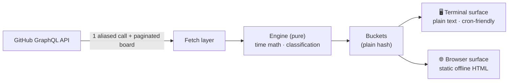
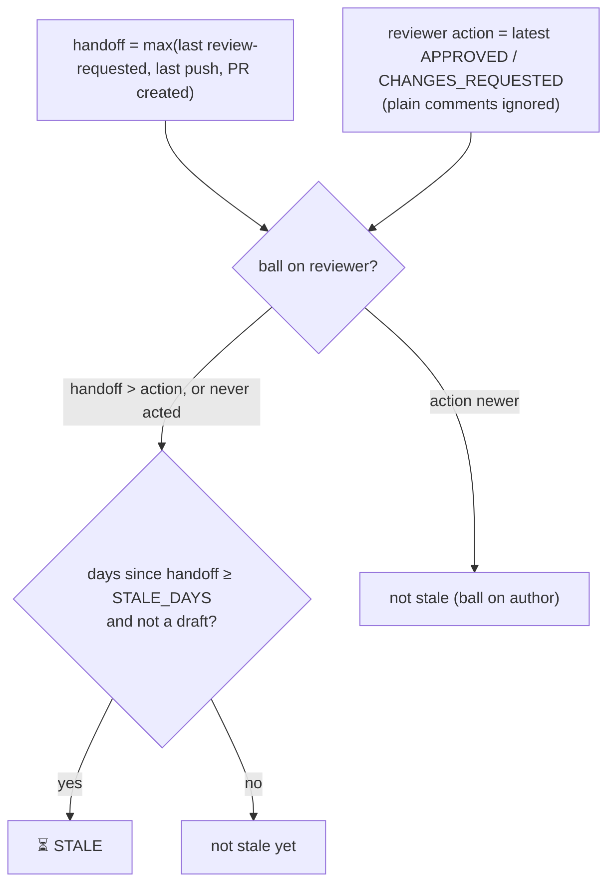

<div align="center">

# 🏹 Kamandar

### Take aim at your GitHub work queue.

***Kamandar*** (کمان‌دار) is Persian for *archer* — one who draws the bow and
finds the target. A personal, **serverless** GitHub command center: one command
shows what you owe, what you're building, what's assigned, and what's gone
quiet — in your terminal or a self-contained browser page.

<br>


</div>

---

```text
Kamandar for @you  —  2026-06-22 09:14  (business days)
========================================================================

📥 Reviews you owe (2)
----------------------
  #482 Tighten retry backoff  (acme/api)
    https://github.com/acme/api/pull/482
  #477 Cache token introspection  (acme/web)
    https://github.com/acme/web/pull/477

🔨 Currently building (WIP) (1)
-------------------------------
  #503 Spike: pluggable providers  (acme/api)
    https://github.com/acme/api/pull/503

⏳ Your PRs gone quiet (1)
--------------------------
  #501 Add billing webhook  (acme/api)  — 3 business days since you handed off
    https://github.com/acme/api/pull/501
```

---

## ✨ What it shows — four buckets (+ one bonus)

| # | Bucket | What lands here |
|---|--------|-----------------|
| 1 | 📥 **Reviews you owe** | Open PRs where review is requested *from you* |
| 2 | 🔨 **Currently building (WIP)** | Your own open **draft** PRs |
| 3 | 📋 **Assigned, not started** | Projects V2 issues assigned to you whose **Status** is in a configurable "not started" set |
| 4 | ⏳ **Your PRs gone quiet** | Your **ready** PRs where the ball is on the reviewer past a threshold |
| ➕ | 🙈 **Ready, no reviewer requested** | *(bonus)* Your ready PRs with nobody asked to review and no reviews yet — silently invisible to everyone |

---

## 🚀 Quick start

> Requires **Ruby 3.2+**. No gems — standard library only.

```sh
git clone https://github.com/cdrrazan/Kamandar.git
cd Kamandar

export GITHUB_TOKEN=ghp_xxx          # classic PAT: repo, read:org, read:project
export GH_LOGIN=your-username
export PROJECT_URL='https://github.com/orgs/YourOrg/projects/10/views/5'

ruby lib/kamandar.rb             # terminal output (default)
ruby lib/kamandar.rb --browser   # render + open a static HTML page
ruby lib/kamandar.rb -b --watch 60   # live tab, refreshed every 60s
```

Put it on your `PATH` if you like:

```sh
chmod +x lib/kamandar.rb
ln -s "$PWD/lib/kamandar.rb" ~/.local/bin/kamandar
```

---

## 📂 Project layout

```text
Kamandar/
├── lib/
│   └── kamandar.rb     # engine + both surfaces (single file, stdlib only)
├── test/
│   └── test_kamandar.rb  # acceptance tests — zero network, 39 cases
├── README.md
├── CONTRIBUTING.md
├── SECURITY.md
├── V2.md                   # multi-provider roadmap (design only)
└── LICENSE
```

---

## ⚙️ Configuration

> CLI flags take precedence over environment variables.

| Var / flag | Required | Default | Purpose |
|---|:---:|---|---|
| `GITHUB_TOKEN` | ✅ | — | Classic PAT: `repo`, `read:org`, `read:project` |
| `GH_LOGIN` | ✅ | — | Your GitHub username |
| `OUTPUT` / `--browser`, `-b` | | `terminal` | Surface: `terminal` or `browser`. The flag forces browser and overrides `OUTPUT`. |
| `WATCH_SECONDS` / `--watch N` | | `0` (off) | Browser only: re-fetch + rewrite the page every N seconds |
| `PROJECT_URL` | for #3 | — | Board/view URL, e.g. `https://github.com/orgs/Recognize/projects/10/views/5`. When set, PR buckets (#1, #2, #4, bonus) are also scoped to that **org**; unset = account-wide. |
| `NOT_STARTED_STATUSES` | | `Todo,Backlog,No Status` | Status names treated as "not started" (case-insensitive) |
| `ITERATION_FILTER` | | `off` | `current` restricts #3 to the active sprint |
| `ITERATION_FIELD` | | `Iteration` | Board's iteration field name |
| `STALE_DAYS` | | `2` | Threshold (in days) for bucket #4 |
| `DAY_MODE` | | `business` | `business` (skip Sat/Sun) or `calendar` |

Only the **org** and **project number** are parsed from `PROJECT_URL` (via
`/orgs/<org>/projects/<num>`); the saved-view number is ignored — see
[Non-goals](#-non-goals--known-limitations).

---

## 🏗️ Architecture

**Engine → buckets → Surface** — three separable layers. The engine is pure and
side-effect-free; surfaces only consume the buckets hash and never re-query or
re-classify.



- **Engine** — pure functions (GraphQL building, time math, classification),
  unit-testable with zero network.
- **Buckets** — a plain hash the engine returns.
- **Surface** — one tiny contract (`render(buckets, ...) -> String` + an
  `emit`). Two implementations today (terminal, browser); adding email or a
  menubar app later requires **no engine change**.

Everything is guarded by `if __FILE__ == $PROGRAM_NAME` so the test suite can
`require` the file with zero network and no ENV reads.

---

## 🖥️ Surfaces

The same classified buckets feed both surfaces.

### Terminal (default)

Plain text grouped by bucket, no ANSI — safe to pipe to `mail`. Ideal for cron.

### Browser (serverless)

Renders **one self-contained HTML document** (inline CSS, no external/CDN
resources, works offline over `file://`) to a stable path
(`<tmpdir>/kamandar.html`) and opens it in your default browser. Bucket #4
gets a warning accent and a "days since handoff" badge per card. Dark mode via
`prefers-color-scheme`.

- **Watch mode** (`--watch N`): re-fetches, re-classifies, and rewrites the same
  file every N seconds — opening the browser only on the first cycle. The page
  carries `<meta http-equiv="refresh">` so the open tab reloads itself.
  Meta-refresh over `file://` works in current Chrome, Firefox, and Safari.
- 🔒 **Security:** the page is a static in-process snapshot. It makes no GitHub
  calls and **never contains your token or any secret** — see
  [SECURITY.md](SECURITY.md).

---

## ⏳ Bucket #4 — the handoff-vs-reviewer race

Keying off `reviewDecision == REVIEW_REQUIRED` is **wrong**: after a reviewer
requests changes and the author pushes fixes, `reviewDecision` stays
`CHANGES_REQUESTED` until the reviewer re-reviews — so the PR you most want
flagged gets dropped. kamandar uses a **timestamp race** instead.



| Scenario | Result |
|---|---|
| Fresh, awaiting review | ⏳ stale |
| Changes requested, not yet fixed | ✅ not stale (ball on author) |
| Changes requested, **then pushed** | ⏳ stale |
| Approved, no new commits | ✅ not stale |
| Approved, **then pushed** | ⏳ stale |
| No reviewer at all | 🙈 forgot-reviewer (not stale) |

---

## 📨 Push layer (terminal mode)

No scheduler code lives in the tool. Wire terminal output into your own cron —
e.g. weekday mornings at 8:30, emailed to yourself:

```cron
30 8 * * 1-5  GITHUB_TOKEN=... GH_LOGIN=you PROJECT_URL=... \
              ruby /path/lib/kamandar.rb | mail -s "Kamandar" you@example.com
```

Swap `mail` for `notify-send` (Linux desktop) or `terminal-notifier` (macOS).
Browser mode is for interactive/ambient use (optionally with `--watch`), not cron.

---

## ✅ Tests

Every acceptance scenario is encoded with a fixed "today" (Monday 2026-06-22)
and fabricated fixtures — **zero network**.

```sh
ruby test/test_kamandar.rb
# ...
# 39 passed, 0 failed
```

---

## 🗺️ Roadmap

A **v2** that abstracts the provider layer to support GitLab and other project
managers (Jira, Linear) is sketched in [V2.md](V2.md).

---

## 🚫 Non-goals / known limitations

- The saved **view** filter DSL is **not** replicated; #3 is approximated by
  Status (+ optional iteration). Only org + project number are read from the URL.
- "Commented" reviews are intentionally ignored — a comment doesn't flip the ball.
- Any push (incl. a typo fix or rebase/force-push) resets the #4 clock by design
  ("you resubmitted"). To reset only on an explicit re-request, drop `last_push`
  from `handoff_at` in the engine.
- Browser mode is a **static snapshot** rendered in-process: no client-side
  GitHub calls, no live data except via `--watch` re-runs. The token never
  reaches the page.
- Single user, single token, no multi-tenant concerns.

---

## 🤝 Contributing

See [CONTRIBUTING.md](CONTRIBUTING.md). Security policy in [SECURITY.md](SECURITY.md).

## 📄 License

[MIT](LICENSE) © 2026 cdrrazan
